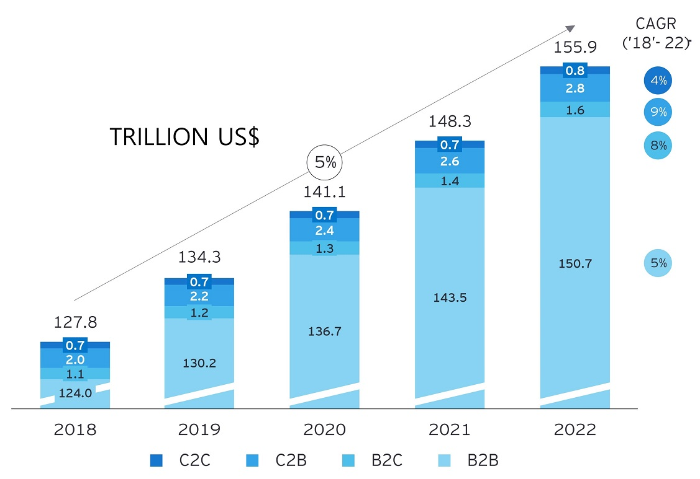
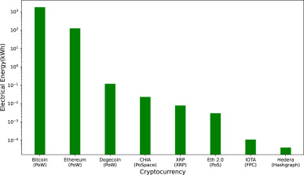

# Ripple Labs - Case Study
<!-- Implementation notes
The following features have been used in this markdown document:
  1. Basic Markdown: # Headings, unordered lists, ordered lists, hyperlinks, text styling (bold, italic etc), backslash escaping of special symbols, images (from this repository and external sources eg YouTube), line breaks, quotes, source comments
  2. Enhanced / Advanced Markdown / HTML (note: some features only work on GitHub User Interface not Visual Studio Code): Footnotes, Accordion (HTML summary/details tags), Mouse-over for defined terms (see aHTML anchor tag), use of HTML entities (eg &nbsp; ), tables
  3. User features: a disclaimer, a table of contents, a glossary of defined terms and acronyms, mouse-over for abbreviations.

Acknowledgement goes to Brian Childress at https://brianchildress.co/variables-in-markdown/ and  John Gruber on https://daringfireball.net/projects/markdown/syntax#link for demonstrating the technique of variables in markdown through use of links. This approach stays more true to pure markdown versus the inital approach that had been taken using HTML anchor tags, eg: '<a href="#glossary-title">Glossary definition</a>', which also meant duplication of the definition text at each reference.

TO DO:
* technology stack include XRPL and its associated stacks
* Last section
* references as per Purdue quotation style
* Table of contents

-->

Author: Bruno Ivasic   
Date: 31 August 2023  

**Disclaimer:** This case study is ***NOT*** intended to provide legal, financial or investment advice of any kind.

## Table of Contents
* [Overview and Origin](#overview-and-origin)
* [Business Activities](#business-activities)
* [Landscape](#landscape)
* [Results](#results)
* [Recommendations](#recommendations)
* [Glossary](#glossary)
* [References](#references)

## Overview and Origin

* *Name of company*   
Ripple Labs Inc. ("Ripple").

* *When was the company incorporated?*   
In short, 2011. The entity was initially incorporated as "NewCoin Inc."[^SoS-NewCoin] on 19 September 2012, then renamed to "OpenCoin Inc."[^SoS-OpenCoin] on 3 October 2012, and finally renamed to "Ripple Labs Inc."[^SoS-Ripple] on 18 October 2013.

* *Who are the founders of the company?*   
Chris Larsen and Jed McCaleb co-founded the company.[^tracxn]

* *How did the idea for the company (or project) come about?*   
 Larsen attributes the idea for the company's key product, the XRP Ledger, originating in 2004 from the "Ripple Project" initially conceived by Ryan Fuger.[^youtube-how]

  In early 2011, three developers—David Schwartz, Jed McCaleb, and Arthur Britto—were fascinated with Bitcoin but observed the waste inherent in mining. They sought to create a more sustainable system for sending value (an idea outlined in a May 2011 forum post: [“Bitcoin without mining”](https://bitcointalk.org/index.php?topic=10193.0)).[^Bitcoin_Talk]

  

* *How is the company funded? How much funding have they received?*   
    Ripple has raised a total of US$293.8M in funding over 14 rounds between May 2015 to August 2021 from 43 different investors.[^CrunchBase]

## Business Activities:

* *What specific financial problem is the company or project trying to solve?*   
Ripple's crypto and blockchain solutions are designed to "move, manage and tokenize value"[^RippleSolutions] predominantly for the following use cases:
   * Cross-Border Payments: Enable global money transfers
   * Crypto Liquidity: Source digital assets
   * Central Bank Digital Currency: Implement [CBDCs][def-cbdc].

* *Who is the company's intended customer?*   
  Ripple is mainly targeting business customers[^RippleAbout] such as banks and financial institutions, that in turn use Ripple solutions for various types of consumers. Some examples of these include:  
  * [Siam Commercial Bank: Enabling better payouts](https://ripple.com/customer-case-study/scb/)  
  * [Nium: Eliminating prefunding](https://ripple.com/customer-case-study/nium/)
  * [MoneyMatch: Offering lower-cost remittances](https://ripple.com/customer-case-study/moneymatch/)

* *Is there any information about the market size of this set of customers?*   
  In 2021, Ernest &amp; Young[^EYFlows] estimated the total global cross-border payment flow to exceed US$156 trillion by 2022, with a <a title="Compound Annual Growth Rate" href="#cagr">CAGR</a> of 5%, segmented as follows:

    | Segment | Value | Notes |
    | :--- | :---: | :--- |
    |[B2B][def-b2b]| US$150t |Transactions make up the largest share by far.|
    |[C2B][def-c2b]| US$2.8t |Cross-border e-commerce and offline tourism spend.|
    |[B2C][def-b2c]| US$1.6t |Wage salaries or interest payments.|
    |[C2C][def-c2c]| US$0.8t | Remittance payments.|

    ***Table 1:*** Predicted global cross-border payment flow by segment.[^EYFlows]

    
    ***Figure 1:*** Global cross-border payments flows split by use case[^EYFlows]

* *What solution does this company offer that their competitors do not or cannot offer? (What is the unfair advantage they utilize?)*   
  Ripple aims to disrupt the status quo of cross-border payments. Through the use of blockchain and modern APIs, Ripple enables financial institutions who are part of the network "RippleNet" to send money globally, instantly, reliably and for fractions of a penny. Being part of RippleNet solves three key issues with payments:
  1. Speed and certainty
  1. Liquidity management
  1. Transparency

  With RippleNet, customers can quickly access new markets, expand their services and deliver the best customer experience in global payments today. With a single connection, customers can access the best blockchain technology for global payments, payout capabilities in over 40 currencies, On-Demand Liquidity as an alternative to pre-funding and operational consistency through a common rulebook.[^RippleFAQ]

  
* *Which technologies are they currently using, and how are they implementing them? (This may take a little bit of sleuthing–– you may want to search the company’s engineering blog or use sites like Stackshare to find this information.)*   
  
    Ripple appears to adopt the following technologies[^StackShare],[^xrplrefs]:
      

      
Application and Data

    * [Amazon S3](https://aws.amazon.com/s3/): AWS' Simple Storage Service where data is stored as objects within resources called “buckets”, and a single object can be up to 5 terabytes in size.
    * [Amazon EC2](https://aws.amazon.com/ec2/): AWS' Elastic Compute Cloud which offers (virtual) cloud compute as a service allowing customer like Ripple to rent rather than buy physical computing systems.  
    * [ES6 (Standard ECMA-262 6th Edition)](https://262.ecma-international.org/6.0/): A new version of the Javascript programming language.
    * [HTML5](https://www.w3.org/TR/2011/WD-html5-20110405/): HyperText Markup Language version 5, used for coding web pages.    
    * [Google Drive](https://www.google.com/intl/en_au/drive/): Cloud storage.   
    * [Java](https://www.oracle.com/java/): programming language / development platform.   
    * [JavaScript](https://developer.oracle.com/languages/javascript.html): programming language.   
    * [jQuery](https://jquery.com/): JavaScript library that simplifies HTML document traversal and manipulation, event handling, animation, and Ajax.   
    * [Kafka](https://kafka.apache.org/): open-source distributed event streaming platform.   
    * [NGINX](https://www.nginx.com/): web server that can also be used as a reverse proxy, load balancer, mail proxy and HTTP cache.   
    * [PostgreSQL](https://www.postgresql.org/): open source object-relational database system.   
    * [RabbitMQ](https://www.rabbitmq.com/): open source message broker.   
    * [React](https://react.dev/): open-source front-end JavaScript library for building web and native user interfaces.   
    * [Redis](https://redis.io/): open source, in-memory data store used by  developers as a database, cache, streaming engine, and message broker.    
    * [TypeScript](https://www.typescriptlang.org/): a programming language based on Javascript.    
      

      

      
Utilities

      * [Google Analytics](https://marketingplatform.google.com/about/analytics/): service offered by Google that tracks and reports website traffic and also the mobile app traffic and events.
      

      

      
Dev Ops

      * [Babel](https://babeljs.io/): JavaScript compliler.   
      * [Docker](https://www.docker.com/): platform designed to help developers build, share, and run container applications.   
      * [GitHub](https://github.com/): platform and cloud-based service for software development and version control using Git.
      * [Jenkins](https://www.jenkins.io/): open source automation server which helps automate parts of software development related to building, testing, and deploying, facilitating continuous integration and continuous delivery.
      

      

      
Business Tools

      * [Confluence](https://www.atlassian.com/software/confluence): web-based corporate wiki.   
      * [G Suite (now known as Workspace)](https://workspace.google.com/intl/en_au/): a collection of cloud computing, productivity and collaboration tools, software and products.   
      * [Jira](https://www.atlassian.com/software/jira): issue tracking.
      * [Slack](https://slack.com/intl/en-au) instant messaging.  
      * [WordPress](https://wordpress.com/):  website builder and content management system.
      

 
      

      
XRP Ledger
      

      * [Python](https://www.python.org/)
      * [Java](https://www.oracle.com/java/): programming language / development platform.   
      * [JavaScript](https://developer.oracle.com/languages/javascript.html): programming language.   
      * [TypeScript](https://learn.microsoft.com/en-us/archive/msdn-magazine/2014/june/typescript-enhance-your-javascript-investment-with-typescript):  superset of the JavaScript programming language. 
      * [C++](https://isocpp.org/std/the-standard): programming language.
      * [Ruby](https://www.ruby-lang.org/en/): programming language.
      * [Tom's Obvious Minimal Language "TOML"](https://toml.io/en/): definition language for configuration files.    
      * [HTTP APIs](https://www.ietf.org/rfc/rfc2616.txt): Hypertext Transfer Protocol (HTTP) is an application-level protocol for distributed, collaborative, hypermedia information systems.   
      * [WebSocket APIs](https://www.rfc-editor.org/rfc/rfc6455): specification for two-way communication between a client running untrusted code in a controlled environment to a remote host that has opted-in to communications from that code. 
      * [Linux](https://www.linux.com/what-is-linux/): Operating System.
      
      

## Landscape:

* *What domain of the financial industry is the company in?*  
  Ripple operates in the payments, crypto currency and blockchain domains.

* *What have been the major trends and innovations of this domain over the last 5-10 years?*  
    In the crypto and blockchain domains, interest has been growing for use of blockchain in applications besides cybercurrency since 2016. The trend continues as new use cases emerge, including voting, real estate, fitness tracking, intellectual rights, the internet of things and vaccine distribution. Multiple cloud providers began offering "blockchain as a service" during the period.[^TechTarget]

    Trends in payments[^RBA2020] over the last 5 to 10 years include:  
    * Faster domestic payments (NPP/Osko/PayID), which has facilitated straight through processing
    * Buy Now Pay Later
    * Mobile device tap and go
    * Crypto currencies
    * Blockchain (e.g. XRP) as digital currencies and expedited payments
    * A decline in cash transactions in favour of digital 

* *What are the other major companies in this domain?*  
   Some examples, amongst the many blockchain platform companies, include[^Gartner]:
   * IBM Blockchain
   * Ethereum
   * Stellar
   * Oracle Blockchain Cloud Service
   * Swirlds
   * Tangle
   * Bitcoin
   * Quorum

  
## Results

* *What has been the business impact of this company so far?*   
  >***RippleNet members and their customers — corporations and consumers alike — are increasingly reaping the benefits of instant, on-demand, certain and low-cost payments with Ripple solutions, ultimately sharpening their competitive edges. As more financial institutions join RippleNet, instant payments will reach more destinations and costs will further compress, enabling members to continuously improve their global payments services.***[^RipplePR100]

  So far, Ripple's accomplishments include:
  * Ripple has processed nearly $30B worth of volume and 20M transactions since RippleNet was first launched. In 2022, approximately 60% of those payments were sent through <a title="On Demand Liquidity" href="#odl">ODL</a>.[^RippleInsightsQ42022]   
  * Ripple has over 300 business customers which continues to expand.
  * Ripple’s crypto-powered payment solution is available in nearly 40 payout markets, up from just three markets in 2020.  

  Benefits claimed by some of Ripple's customers include[^RippleCustomers]:
    * 40% reduction in cross-border payment costs since MoneyMatch joined RippleNet.   
    * US$25M saved by Sentbe customers on foreign exchange conversion and transaction fees.
    * Payments via Modulr in less than 10 seconds.
    * 98% savings on domestic transfer rates for NIUM customers.

  Despite its successes, Ripple has faced some significant legal challenges, which include:   
   * A US$700,000 civil money penalty in 2015, which was the first against a virtual currency for willful violation of several requirements of the Bank Secrecy Act \(BSA\)[^FinCEN]   
   * An action filed in 2022 by the <a title="U.S. Securities and Exchange Commission" href="#sec">SEC</a> charging Ripple and two executives with conducting a $1.3b unregistered securities offering.[^SECPR]  Although a landmark ruling in favor of Ripple was made in July 2023[^Torres], [^HKLaw-1] for three of the four transaction types at issue, the <a title="[U.S. Securities and Exchange Commission" href="#sec">SEC</a> plans to appeal the court's ruling.[^Reuters]

* *What are some of the core metrics that companies in this domain use to measure success? How is your company performing, based on these metrics?*    

  Typical metrics include:
  * Processing throughput (in transactions per second),
  * Cost of processing
  * End to end Processing speed
  * Energy consumption
  * Buy / sell volume on exchanges
  * Price of the token

* *How is your company performing relative to competitors in the same domain?*   

  A comparison of Ripple's XRP against prominent cryptocurrencies is presented in Table 2 below, which highlights the extent of XRP's performance advantage.

  | Cryptocurrency / Blockchain | Bitcoin / Bitcoin | Ether / Ethereum&nbsp;1.0 |	XRP / XRP&nbsp;Ledger|
  |:---| :---| :--- | :--- |
  |Key Use  | Store of Value   |Smart Contracts  |  Payments |
  |Speed to Transact (seconds) | 409.98  | 300.00 |  3.83 |
  |Cost per Transaction (US$)  | $0.465 | $9.00 | $0.0002 |
  |Transactions Per Second | 5 | 10 | 1,500[^RippleCryptoIntro] - 3,400[^RippleXrp]|

  ***Table 2:*** Comparison of Prominent Cryptocurrencies [^RippleCryptoIntro],  [^RippleXrp]
  
  Further, Kohli et al.,[^Kohli-2023] suggest XRP is significantly more energy efficient than other major cryptocurrencies by an order of up to 100,000 times compared to BitCoin. Although there are other cryptocurrencies, such as Hedera, which are even more efficient than XRP.

		
      
   ***Figure 2:*** Energy consumption per transaction for various cryptocurrencies (and their consensus mechanisms). Source: Kohli et al (2023)[^Kohli-2023]

## Recommendations

* *If you were to advise the company, what products or services would you suggest they offer? (This could be something that a competitor offers, or use your imagination!)*   

  
  Some of the negative comments posted on [Gartner Peer Insights](https://www.gartner.com/reviews/market/blockchain-platforms/vendor/ripple/product/ripple) about Ripple's blockchain product suggest it doesn't really support [smart contracts][def-smart-contract] like other blockchain solutions.[^gpr-726158], [^gpr-842917]  
  
  Upon investigation of this claim, using a search within [Ripple's website](https://www.ripple.com) for the term "smart contract" indeed returned no results. However, a separate [Google Search restricted to the Ripple website](https://www.google.com/search?q=%22smart+contract%22+site%3Aripple.com) returned about 250 results, which of interest included:
  1. "Use an Escrow as a Smart Contract"[^xrplsc]; and
  1. "XRPL Hooks - Smart Contract proposal for the XRP Ledger"[^xrpl-hooks]
  
    *(As a side note: perhaps Ripple's website search engine should be reindexed).*

    Recently, coincidently, a whitepaper for the Xahau Ledger was released titled ["The Smart Contract Sidechain for the XRPL Ecosystem"](https://github.com/Xahau/Whitepaper/blob/main/Xahau-Whitepaper.pdf).

  Reddit user "lj23ft" states[^reddit]:
  > *"There are several businesses that have been waiting for these features and instead of waiting for Ripple they built a sidechain so they could get these features sooner."*

  
* Why do you think that offering this product or service would benefit the company?

  [Zion Market Research](https://www.zionmarketresearch.com/report/smart-contracts-market) suggests:   
  > *in terms of revenue, the global smart contracts market size was valued at around USD 1750 million in 2022 and is projected to reach ***USD 9850 million***, by 2030*[^zion-sc]

  Although Ripple is mentioned as a technology, its statistics are not, perhaps implying it is not a dominant player due to their current technology. XLR Ledger is not mentioned as a platform either.

* What technologies would this additional product or service utilize?

  The service would use [XRPL Hooks][def-hooks] as documented on [xrpl-hooks.readme.io](https://xrpl-hooks.readme.io/docs).

* *Why are these technologies appropriate for your solution?*   
Developed for the XRP Ledger, [hooks][def-hooks] work "on-chain" as opposed to other solutions which work "off-chain" or "side-chain", and depending on one's view, either the advantage or risk that "hooks have the ability to control, with atomicity and finality, the logical flow and execution of transactions on the accounts to which the hooks are configured".[^wietse-h2]

---

## Glossary

### B2B
[def-b2b]: #b2b "Business to Business."

Business to Business.

---

### B2C
[def-b2c]: #b2c "Business to Consumer."

Business to Consumer.

---

### C2B
[def-c2b]: #c2b "Consumer to Business."

Consumer to Business.

---

### C2C
[def-c2c]: #c2c "Consumer to Consumer."

Consumer to Consumer.

---

### CAGR
[def-cagr]: #cagr "Compound Annual Growth Rate."

Compound Annual Growth Rate.

---

### CBDC
[def-cbdc]: #cbdc "Central Bank Digital Currency."

Central Bank Digital Currency.

---

### Hooks
[def-hooks]: #hooks "Small efficient web assembly modules that run on the XRP Ledger at Layer 1 (on-chain). This is distinct from Codius, Hot Pocket, Flare and other Layer 2 solutions (which are off-chain or side-chain)."

Small efficient web assembly modules that run on the XRP Ledger at Layer 1 (on-chain). This is distinct from Codius, Hot Pocket, Flare and other Layer 2 solutions (which are off-chain or side-chain).[^wietse-h2]

---

### ODL
[def-odl]: #odl "On Demand Liquidity."

On Demand Liquidity.

---

### SEC
[def-sec]: #sec "Securities and Exchange Commission."

Securities and Exchange Commission.

---

### Sidechain
[def-sidechain]: #sidechain "A separate, independent blockchain linked to the main blockchain (mainchain) using a two-way bridge. It enables tokens or other digital assets to be transferred between the mainchain and the sidechain."
A separate, independent blockchain linked to the main blockchain (mainchain) using a two-way bridge. It enables tokens or other digital assets to be transferred between the mainchain and the sidechain.[^cryptocom]

---

### Smart Contract
[def-smart-contract]: #smart-contract "A blockchain-based program that encodes the conditions and fulfillment of an agreement between two or more parties and automatically fulfills the terms of the agreement once conditions are met."
A blockchain-based program that encodes the conditions and fulfillment of an agreement between two or more parties and automatically fulfills the terms of the agreement once conditions are met.[^xrplsc]

---

### XRP
[def-xrp]: #xrp "XRP is the cryptocurrency that is native to the XRP Ledger."
XRP is the cryptocurrency that is native to the [XRP Ledger][def-xrpl].[^investopedia-xrp]

---

### XRPL
[def-xrpl]: #xrpl "The XRP Ledger is an open-source, public, decentralized blockchain."

The [XRP][def-xrp] Ledger is an open-source, public, decentralized blockchain.[^investopedia-xrp]

---

## References
<!-- Using Purdue Electronic Sources citation styles as per:
     https://owl.purdue.edu/owl/research_and_citation/apa_style/apa_formatting_and_style_guide/reference_list_electronic_sources.html
-->

[^RippleAbout]: [Ripple Labs Inc. (2021). Intro to Ripple Fact Sheet. https://ripple.com/files/Intro-to-Ripple-Fact-Sheet.pdf](https://ripple.com/files/Intro-to-Ripple-Fact-Sheet.pdf)

[^RippleCryptoIntro]: [Ripple Labs Inc. (2021). An introduction to Cryptocurrency. https://ripple.com/files/Intro-to-Crypto-Fact-Sheet.pdf](https://ripple.com/files/Intro-to-Crypto-Fact-Sheet.pdf)

[^RippleFAQ]: [Ripple Labs Inc. (2023). Frequently Asked Questions https://ripple.com/faq/](https://ripple.com/faq/)

[^RippleInsightsQ42022]: [Ripple Labs Inc. (2023, January 30). Q4 2022 XRP Markets Report. https://ripple.com/insights/q4-2022-xrp-markets-report/](https://ripple.com/insights/q4-2022-xrp-markets-report)

[^RippleCustomers]: [Ripple Labs Inc. (2023). Customers. Retrieved 2023, August 31. https://ripple.com/customers/](https://ripple.com/customers/)

[^RippleSolutions]: [Ripple Labs Inc. (2023). Solutions https://ripple.com](https://ripple.com/)

[^RipplePR100]: [Ripple Labs Inc. (2017, October 10). Ripple’s Blockchain Network Is Now More Than 100 Strong. https://ripple.com/ripple-press/ripples-blockchain-network-now-100-strong/](https://ripple.com/ripple-press/ripples-blockchain-network-now-100-strong/)

[^RippleXrp]:[Ripple Labs Inc. (2023, August 24). XRP Overview. https://ripple.com/xrp/](https://ripple.com/xrp/)

[^CrunchBase]: [Ripple Labs Company Financials (n.d.) Crunchbase Inc. (2023, August 30). https://www.crunchbase.com/organization/ripple-labs/company_financials](https://www.crunchbase.com/organization/ripple-labs/company_financials)

[^Bitcoin_Talk]: [McCaleb J., (2011, May 27). Bitcoin without mining. Bitcoin Forum. https://bitcointalk.org/index.php?topic=10193.0](https://bitcointalk.org/index.php?topic=10193.0)

[^EYFlows]: [Ernst &amp; Young Global Ltd. (2021). How new entrants are redefining cross-border payments. https://www.ey.com/en_au/banking-capital-markets/how-new-entrants-are-redefining-cross-border-payments](https://www.ey.com/en_au/banking-capital-markets/how-new-entrants-are-redefining-cross-border-payments)

[^FinCEN]: [U.S. Financial Crimes Enforcement Network. (2015, May 5). FinCEN Fines Ripple Labs Inc. in First Civil Enforcement Action Against a Virtual Currency Exchanger. https://www.fincen.gov/news/news-releases/fincen-fines-ripple-labs-inc-first-civil-enforcement-action-against-virtual](https://www.fincen.gov/news/news-releases/fincen-fines-ripple-labs-inc-first-civil-enforcement-action-against-virtual)

[^SECPR]: [Securities Exchange Commission, (2020, December 22). SEC Charges Ripple and Two Executives with Conducting $1.3 Billion Unregistered Securities Offering. https://www.sec.gov/news/press-release/2020-338](https://www.sec.gov/news/press-release/2020-338)

[^HKLaw-1]: [Mascianica S., Magee J., McCarron Turner J. (2023, July 20). SEC v. Ripple: When a Security Is Not a Security - Summary Judgment Battle Results in Split Decision, Blow to SEC Enforcement. https://www.hklaw.com/en/insights/publications/2023/07/sec-v-ripple-when-a-security-is-not-a-security](https://www.hklaw.com/en/insights/publications/2023/07/sec-v-ripple-when-a-security-is-not-a-security) 

[^Torres]: [Torres A. (2023, July 13). Order on Case 1:20-cv-10832-AT-SN (SEC vs Ripple Labs et al) Document 874. United States District Court Southern District Of New York. https://www.nysd.uscourts.gov/sites/default/files/2023-07/SEC%20vs%20Ripple%207-13-23.pdf](https://www.nysd.uscourts.gov/sites/default/files/2023-07/SEC%20vs%20Ripple%207-13-23.pdf)

[^Reuters]: [Stempel J. (2023, August 12). US SEC seeks to appeal Ripple Labs crypto decision. Reuters. https://www.reuters.com/legal/us-sec-appeal-ripple-labs-court-ruling-2023-08-09/](https://www.reuters.com/legal/us-sec-appeal-ripple-labs-court-ruling-2023-08-09/)

[^SoS-NewCoin]: [Articles of Incorporation #3505635 NewCoin Inc. (2023 September 19). Californian Secretary of State (USA). https://bizfileonline.sos.ca.gov/api/report/GetImageByNum/187089170177186059061179244045225015102149150023](https://bizfileonline.sos.ca.gov/api/report/GetImageByNum/187089170177186059061179244045225015102149150023)

[^SoS-OpenCoin]: [Certificate of Amendment #A0732979 Renamed to OpenCoin Inc. (2023, October 3). Californian Secretary of State (USA). https://bizfileonline.sos.ca.gov/api/report/GetImageByNum/116067222226235006001172039135168044050121032046](https://bizfileonline.sos.ca.gov/api/report/GetImageByNum/116067222226235006001172039135168044050121032046)

[^SoS-Ripple]: [Certificate of Amendment #A0747403 Renamed to Ripple Inc. (2023, October 18). Californian Secretary of State (USA). https://bizfileonline.sos.ca.gov/api/report/GetImageByNum/076031074160242065134127075129213240171193013106](https://bizfileonline.sos.ca.gov/api/report/GetImageByNum/076031074160242065134127075129213240171193013106)

[^tracxn]: [Ripple Founders. (2023, August 17). Tracxn. https://tracxn.com/d/companies/ripple/__RI5NqNB2xmmrUkf5iftdStz97omfcqLLEWHh-AydmF8/founders-and-board-of-directors](https://tracxn.com/d/companies/ripple/__RI5NqNB2xmmrUkf5iftdStz97omfcqLLEWHh-AydmF8/founders-and-board-of-directors)

[^Kohli-2023]: [Kohli V. et al. (2023). An analysis of energy consumption and carbon footprints of cryptocurrencies and possible solutions. Digital Communications and Networks, Vol.(1), page 79-89. https://doi.org/10.1016/j.dcan.2022.06.017](https://doi.org/10.1016/j.dcan.2022.06.017)

[^Stackshare]: [Ripple Company Profile. (2023, August 26). Stackshare.io. https://stackshare.io/ripple/ripple](https://stackshare.io/ripple/ripple)

[^RBA2020]: [Payments System Board Annual Report – 2020 Trends in Payments, Clearing and Settlement Systems. (2020). Reserve Bank of Australia. (https://www.rba.gov.au/publications/annual-reports/psb/2020/trends-in-payments-clearing-and-settlement-systems.html](https://www.rba.gov.au/publications/annual-reports/psb/2020/trends-in-payments-clearing-and-settlement-systems.html)

[^TechTarget]: [Sheldon R. (2021, September 9). A timeline and history of blockchain technology. TechTarget. Retrieved 2023, August 31. https://www.techtarget.com/whatis/feature/A-timeline-and-history-of-blockchain-technology](https://www.techtarget.com/whatis/feature/A-timeline-and-history-of-blockchain-technology)

[^Gartner]: [Ripple Alternatives. (2023). Gartner. https://www.gartner.com/reviews/market/blockchain-platforms/vendor/ripple/product/ripple/alternatives](https://www.gartner.com/reviews/market/blockchain-platforms/vendor/ripple/product/ripple/alternatives)

[^xrplrefs]: [XRP Ledger References and APIs. (n.d.). XRPL.ORG. Retrieved 2023, August 31. https://xrpl.org/references.html](https://xrpl.org/references.html)

[^xrplsc]: [XRP Ledger Use an Escrow as a Smart Contract. (n.d.). XRPL.ORG. Retrieved 2023, August 31. https://xrpl.org/use-an-escrow-as-a-smart-contract.html](https://xrpl.org/use-an-escrow-as-a-smart-contract.html)

[^xrpl-hooks]: [Hooks - Smart Contract proposal for the XRP Ledger. XRPL HOOKS. Retrieved 2023, August 31. https://xrpl-hooks.readme.io/](https://xrpl-hooks.readme.io/)

[^gpr-726158]: [Peer Review for Ripple. (2020, January 20). Gartner Peer Insights. Retrieved 2023, August 31. https://www.gartner.com/reviews/market/blockchain-platforms/vendor/ripple/product/ripple/review/view/726158](https://www.gartner.com/reviews/market/blockchain-platforms/vendor/ripple/product/ripple/review/view/726158)

[^gpr-842917]: [Peer Review for Ripple. (2019, April 24). Gartner Peer Insights. Retrieved 2023, August 31. https://www.gartner.com/reviews/market/blockchain-platforms/vendor/ripple/product/ripple/review/view/842917](https://www.gartner.com/reviews/market/blockchain-platforms/vendor/ripple/product/ripple/review/view/842917)

[^cryptocom]: [What Are Sidechains? Scaling Blockchain on the Side. (2021, February 4). crypto.com. https://crypto.com/university/what-are-sidechains-scaling-blockchain](https://crypto.com/university/what-are-sidechains-scaling-blockchain)

[^investopedia-xrp]: [What is XRP?. (2021, August 1). Investopedia. https://www.investopedia.com/what-is-xrp-6362550](https://www.investopedia.com/what-is-xrp-6362550)

[^xrpl-xahau]: [Hello Xahau. (2023, August 2023). XRP Ledger Foundation. https://foundation.xrpl.org/2023/08/28/hello-xahau/](https://foundation.xrpl.org/2023/08/28/hello-xahau/)

[^reddit]:[r/XRP \[lj26ft\]. (2023, August 29). What does Xahau mean for XRP? Reddit. https://www.reddit.com/r/XRP/comments/1648zh0/what_does_xahau_mean_for_xrp/jy7ljp9/?utm_source=share&utm_medium=web3x&utm_name=web3xcss&utm_term=1&utm_content=share_button](https://www.reddit.com/r/XRP/comments/1648zh0/what_does_xahau_mean_for_xrp/jy7ljp9/?utm_source=share&utm_medium=web3x&utm_name=web3xcss&utm_term=1&utm_content=share_button)

[^zion-sc]: [Global Smart Contracts Market to grow around USD 9850 million by 2030. (2023, March 3). Zion Market Research. https://www.zionmarketresearch.com/news/global-smart-contracts-market](https://www.zionmarketresearch.com/news/global-smart-contracts-market)

[^wietse-h2]: [Wind W., Hooked #2: Hooks & Security (Smart Contracts on the XRP ledger). (2020, November 14). DEV. https://dev.to/wietse/hooked-2-hooks-security-smart-contracts-on-the-xrp-ledger-83e](https://dev.to/wietse/hooked-2-hooks-security-smart-contracts-on-the-xrp-ledger-83e)

[^youtube-how]: [Ripple. \(2018, March 10\). Ripple and XRP - Part 1: How Ripple Got Started (2018). YouTube. https://www.youtube.com/watch?v=3zW_DN9pkbM ](https://www.youtube.com/watch?v=3zW_DN9pkbM)
